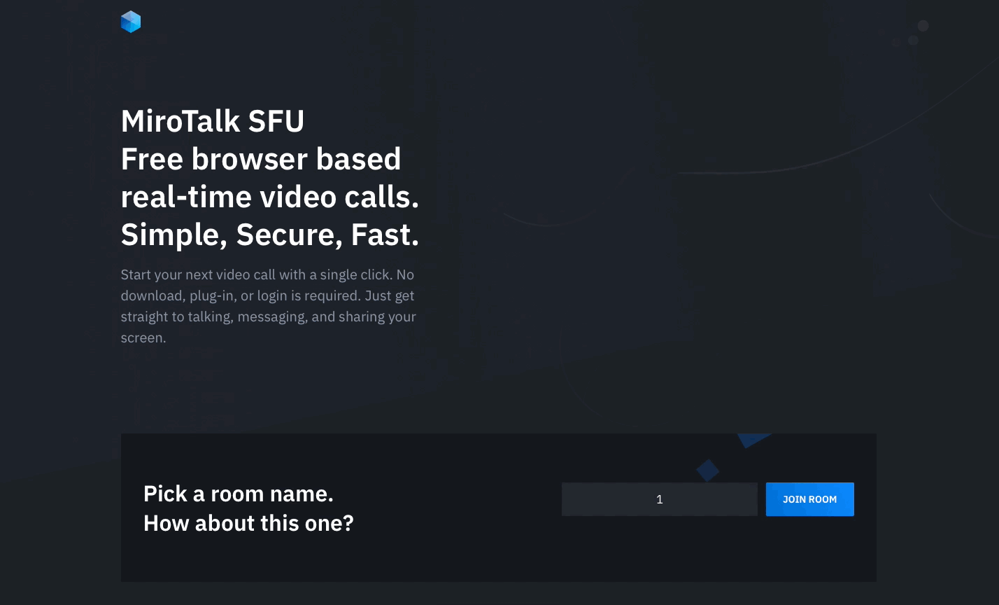

<h1 align="center">MiroTalk SFU</h1>

<br />

<p align="center">Free WebRTC - SFU - Simple, Secure, Scalable Real-Time Video Conferences with support for up to 4k resolution. It's compatible with all major browsers and platforms</p>

<hr />

<p align="center">
    <a href="https://sfu.mirotalk.com/">Explore MiroTalk SFU</a>
</p>

<hr />

<p align="center">
    <a href="https://sfu.mirotalk.com/">
        
    </a>
</p>

<hr />

<p align="center">
    Join our community for questions, discussions, and support on <a href="https://discord.gg/rgGYfeYW3N">Discord</a>
</p>

<hr />

<details>
<summary>Features</summary>

<br/>

-   Is `100% Free` - `Open Source (AGPLv3)` - `Self Hosted` and [PWA](https://en.wikipedia.org/wiki/Progressive_web_application)!
-   Unlimited conference rooms with no time limitations.
-   Live broadcasting streaming.
-   Translated into 133 languages.
-   Support for the OpenID Connect (OIDC) authentication layer.
-   Host protection to prevent unauthorized access.
-   User auth to prevent unauthorized access.
-   JWT.io securely manages credentials for host configurations and user authentication, enhancing security and streamlining processes.
-   Room password protection.
-   Room lobby, central gathering space.
-   Room spam mitigations, focused on preventing spam.
-   Geolocation, identification or estimation of the real-world geographic location of the participants.
-   Compatible with desktop and mobile devices.
-   Optimized mobile room URL sharing.
-   Webcam streaming with front and rear camera support for mobile devices.
-   Broadcasting, distribution of audio or video content to a wide audience.
-   Crystal-clear audio streaming with speaking detection and volume indicators.
-   Screen sharing for presentations.
-   File sharing with drag-and-drop support.
-   Choose your audio input, output, and video source.
-   Supports video quality up to 4K.
-   Supports advance Picture-in-Picture (PiP) offering a more streamlined and flexible viewing experience.
-   Record your screen, audio, and video locally or on your Server.
-   Snapshot video frames and save them as PNG images.
-   Chat with an Emoji Picker for expressing feelings, private messages, Markdown support, and conversation saving.
-   ChatGPT (powered by OpenAI) for answering questions, providing information, and connecting users to relevant resources.
-   VideoAI enables users to customize AI avatars to deliver messages, perform tasks, or act out scripts.
-   Speech recognition, execute the app features simply with your voice.
-   Push-to-talk functionality, similar to a walkie-talkie.
-   Advanced collaborative whiteboard for teachers.
-   Real-time sharing of YouTube embed videos, video files (MP4, WebM, OGG), and audio files (MP3).
-   Real-time polls, allows users to create and participate in live polls, providing instant feedback and results.
-   Integrated RTMP server, fully compatible with **[OBS](https://obsproject.com)**.
-   Supports RTMP streaming from files, URLs, webcams, screens, and windows.
-   Full-screen mode with one-click video element zooming and pin/unpin.
-   Customizable UI themes.
-   Right-click options on video elements for additional controls.
-   Supports [REST API](app/api/README.md) (Application Programming Interface).
-   Integration with [Slack](https://api.slack.com/apps/) for enhanced communication.
-   Utilizes [Sentry](https://sentry.io/) for error reporting.
-   And much more...

</details>

<details>
<summary>About</summary>

<br>

-   [Presentation](https://www.canva.com/design/DAE693uLOIU/view)
-   [Video Overview](https://www.youtube.com/watch?v=_IVn2aINYww)

</details>

<details>
<summary>Direct Join</summary>

<br/>

-   You can `directly join a room` by using link like:
-   https://sfu.mirotalk.com/join?room=test&roomPassword=0&name=mirotalksfu&audio=0&video=0&screen=0&notify=0

    | Params       | Type           | Description     |
    | ------------ | -------------- | --------------- |
    | room         | string         | Room Id         |
    | roomPassword | string/boolean | Room password   |
    | name         | string         | User name       |
    | audio        | boolean        | Audio stream    |
    | video        | boolean        | Video stream    |
    | screen       | boolean        | Screen stream   |
    | notify       | boolean        | Welcome message |
    | hide         | boolean        | Hide myself     |
    | token        | string         | JWT             |

</details>

<details>
<summary>Host Protection Configuration</summary>

<br/>

When [host.protected](https://docs.mirotalk.com/mirotalk-sfu/host-protection/) or `host.user_auth` is enabled, the host/users can provide a valid token for direct joining the room as specified in the `app/src/config.js` file.

| Params           | Value                                                                            | Description                                                                            |
| ---------------- | -------------------------------------------------------------------------------- | -------------------------------------------------------------------------------------- |
| `host.protected` | `true` if protection is enabled, `false` if not (default false)                  | Requires the host to provide a valid username and password during room initialization. |
| `host.user_auth` | `true` if user authentication is required, `false` if not (default false).       | Determines whether host authentication is required.                                    |
| `host.users`     | JSON array with user objects: `{"username": "username", "password": "password"}` | List of valid host users with their credentials.                                       |

Example:

```js
    host: {
        protected: true,
        user_auth: true,
        users: [
            {
                username: 'username',
                password: 'password',
            },
            {
                username: 'username2',
                password: 'password2',
            },
            //...
        ],
    },
```

</details>

<details open>
<summary>Embed a meeting</summary>

<br/>

To embed a meeting within `your service or app` using an iframe, you can use the following code:

```html
<iframe
    allow="camera; microphone; display-capture; fullscreen; clipboard-read; clipboard-write; autoplay"
    src="https://sfu.mirotalk.com/newroom"
    style="height: 100vh; width: 100vw; border: 0px;"
></iframe>
```

</details>

<details open>
<summary>Quick Start</summary>

<br/>

-   Before running MiroTalk SFU, ensure you have `Node.js` and all [requirements](https://mediasoup.org/documentation/v3/mediasoup/installation/#requirements) installed. This project has been tested with Node version [18.X](https://nodejs.org/en/download).

-   Requirements install example for `Ubuntu 24.04 LTS`

```bash
# Gcc g++ make
$ apt-get update
$ apt-get install -y build-essential
# Python 3.8 and pip
$ DEBIAN_FRONTEND=noninteractive apt-get install -y tzdata
$ apt install -y software-properties-common
$ add-apt-repository -y ppa:deadsnakes/ppa
$ apt update
$ apt install -y python3.8 python3-pip
# FFmpeg
$ apt install -y ffmpeg
```

---

Install `NodeJS 18.X` and `npm` using [Node Version Manager](https://docs.mirotalk.com/nvm/nvm/)

---

-   Start the server

```bash
# Clone this repo
$ git clone https://github.com/miroslavpejic85/mirotalksfu.git
# Go to to dir mirotalksfu
$ cd mirotalksfu
# Copy app/src/config.template.js in app/src/config.js and edit it if needed
$ cp app/src/config.template.js app/src/config.js
# Install dependencies - be patient, the first time will take a few minutes, in the meantime have a good coffee ;)
$ npm install
# Start the server
$ npm start
# If you want to start the server on a different port than the default use an env var
$ PORT=3011 npm start
```

-   Open [https://localhost:3010](https://localhost:3010) or `:3011` if the default port has been changed in your browser.

<br/>

> \[!NOTE]
>
> To run `MiroTalk SFU` on a `Windows operating system`, you can follow the instructions provided in [this documentation](https://github.com/miroslavpejic85/mirotalksfu/issues/99#issuecomment-1586073853).

</details>

<details open>
<summary>Docker</summary>

<br/>


-   Repository [docker hub](https://hub.docker.com/r/mirotalk/sfu)
-   Install [docker engine](https://docs.docker.com/engine/install/) and [docker compose](https://docs.docker.com/compose/install/)

```bash
# Copy app/src/config.template.js in app/src/config.js IMPORTANT (edit it according to your needs)
$ cp app/src/config.template.js app/src/config.js
# Copy docker-compose.template.yml in docker-compose.yml and edit it if needed
$ cp docker-compose.template.yml docker-compose.yml
# (Optional) Get official image from Docker Hub
$ docker-compose pull
# Create and start containers
$ docker-compose up # -d
# To stop and remove resources
$ docker-compose down
```

-   Open [https://localhost:3010](https://localhost:3010) in your browser.

</details>

<details>
<summary>Documentations</summary>

<br>

-   `Ngrok/HTTPS:` You can start a video conference directly from your local PC and make it accessible from any device outside your network by following [these instructions](docs/ngrok.md), or expose it directly on [HTTPS](app/ssl/README.md).

-   `Self-hosting:` For `self-hosting MiroTalk SFU` on your own dedicated server, please refer to [this comprehensive guide](docs/self-hosting.md). It will provide you with all the necessary instructions to get your MiroTalk SFU instance up and running smoothly.

-   `Rest API:` The [API documentation](https://docs.mirotalk.com/mirotalk-sfu/api/) uses [swagger](https://swagger.io/) at https://localhost:3010/api/v1/docs or check it on live [here](https://sfu.mirotalk.com/api/v1/docs).

```bash
# The response will give you the active meetings (default disabled).
$ curl -X GET "http://localhost:3010/api/v1/meetings" -H "authorization: mirotalksfu_default_secret" -H "Content-Type: application/json"
$ curl -X GET "https://sfu.mirotalk.com/api/v1/meetings" -H "authorization: mirotalksfu_default_secret" -H "Content-Type: application/json"
# The response will give you a entrypoint / Room URL for your meeting.
$ curl -X POST "http://localhost:3010/api/v1/meeting" -H "authorization: mirotalksfu_default_secret" -H "Content-Type: application/json"
$ curl -X POST "https://sfu.mirotalk.com/api/v1/meeting" -H "authorization: mirotalksfu_default_secret" -H "Content-Type: application/json"
# The response will give you a entrypoint / URL for the direct join to the meeting.
$ curl -X POST "http://localhost:3010/api/v1/join" -H "authorization: mirotalksfu_default_secret" -H "Content-Type: application/json" --data '{"room":"test","roomPassword":"false","name":"mirotalksfu","audio":"false","video":"false","screen":"false","notify":"false"}'
$ curl -X POST "https://sfu.mirotalk.com/api/v1/join" -H "authorization: mirotalksfu_default_secret" -H "Content-Type: application/json" --data '{"room":"test","roomPassword":"false","name":"mirotalksfu","audio":"false","video":"false","screen":"false","notify":"false"}'
# The response will give you a entrypoint / URL for the direct join to the meeting with a token.
$ curl -X POST "http://localhost:3010/api/v1/join" -H "authorization: mirotalksfu_default_secret" -H "Content-Type: application/json" --data '{"room":"test","roomPassword":"false","name":"mirotalksfu","audio":"false","video":"false","screen":"false","notify":"false","token":{"username":"username","password":"password","presenter":"true", "expire":"1h"}}'
$ curl -X POST "https://sfu.mirotalk.com/api/v1/join" -H "authorization: mirotalksfu_default_secret" -H "Content-Type: application/json" --data '{"room":"test","roomPassword":"false","name":"mirotalksfu","audio":"false","video":"false","screen":"false","notify":"false","token":{"username":"username","password":"password","presenter":"true", "expire":"1h"}}'
# The response will give you a valid token for a meeting (default diabled)
$ curl -X POST "http://localhost:3010/api/v1/token" -H "authorization: mirotalksfu_default_secret" -H "Content-Type: application/json" --data '{"username":"username","password":"password","presenter":"true", "expire":"1h"}'
$ curl -X POST "https://sfu.mirotalk.com/api/v1/token" -H "authorization: mirotalksfu_default_secret" -H "Content-Type: application/json" --data '{"username":"username","password":"password","presenter":"true", "expire":"1h"}'
```

</details>

<details open>
<summary>Hetzner & Contabo</summary>

<br/>

[](https://hetzner.cloud/?ref=XdRifCzCK3bn)

This application is running for `demonstration purposes` on [Hetzner](https://www.hetzner.com/), one of `the best` [cloud providers](https://www.hetzner.com/cloud) and [dedicated root servers](https://www.hetzner.com/dedicated-rootserver).

---

Use [my personal link](https://hetzner.cloud/?ref=XdRifCzCK3bn) to receive `€⁠20 IN CLOUD CREDITS`.

---

[](https://www.dpbolvw.net/click-101027391-14462707)

Experience also top-tier German web hosting – dedicated servers, VPS, and web hosting at `unbeatable prices`. Reliable, secure, and backed by 24/7 support. [Explore now here](https://www.dpbolvw.net/click-101027391-14462707)

---

To set up your own instance of `MiroTalk SFU` on a dedicated cloud server, please refer to our comprehensive [self-hosting documentation](https://docs.mirotalk.com/mirotalk-sfu/self-hosting/). This guide will walk you through the process step by step, ensuring a smooth and successful deployment.

</details>

<details>
<summary>DigitalOcean</summary>

<br/>

[](https://www.digitalocean.com/?refcode=1070207afbb1&utm_campaign=Referral_Invite&utm_medium=Referral_Program&utm_source=badge)

For personal use, you can start with a single $5 a month cloud server and scale up as needed. You can use [this link](https://m.do.co/c/1070207afbb1) to get a `$100 credit for the first 60 days`.

</details>

<details>
<summary>Live Demo</summary>

<br/>

<a target="_blank" href="https://hetzner.cloud/?ref=XdRifCzCK3bn"></a>

https://sfu.mirotalk.com

[](https://sfu.mirotalk.com/)

</details>

<details>
<summary>Credits</summary>

<br/>

-   [Davide Pacilio](https://cruip.com/demos/solid/) (html template)
-   [Dirk Vanbeveren](https://github.com/Dirvann) (sfu logic)
-   [Mediasoup](https://mediasoup.org) (sfu server)

</details>

<details>
<summary>Contributing</summary>

<br/>

-   Contributions are welcome and greatly appreciated!
-   Just run before `npm run lint`

</details>

<details>
<summary>License</summary>

<br/>

[](LICENSE)

MiroTalk SFU is free and open-source under the terms of AGPLv3 (GNU Affero General Public License v3.0). Please `respect the license conditions`, In particular `modifications need to be free as well and made available to the public`. Get a quick overview of the license at [Choose an open source license](https://choosealicense.com/licenses/agpl-3.0/).

To obtain a [MiroTalk SFU license](https://docs.mirotalk.com/license/licensing-options/) with terms different from the AGPLv3, you can conveniently make your [purchase on CodeCanyon](https://codecanyon.net/item/mirotalk-sfu-webrtc-realtime-video-conferences/40769970). This allows you to tailor the licensing conditions to better suit your specific requirements.

</details>

<details open>
<summary>Support the project</summary>

<br/>

Do you find MiroTalk SFU indispensable for your needs? Join us in supporting this transformative project by [becoming a backer or sponsor](https://github.com/sponsors/miroslavpejic85). By doing so, not only will your logo prominently feature here, but you'll also drive the growth and sustainability of MiroTalk SFU. Your support is vital in ensuring that this valuable platform continues to thrive and remain accessible for all. Make an impact – back MiroTalk SFU today and be part of this exciting journey!

|                                                                                   |                                                                                        |
| --------------------------------------------------------------------------------- | -------------------------------------------------------------------------------------- |
| [](https://broadcastx.de/)           | [](https://hetzner.cloud/?ref=XdRifCzCK3bn) |
| [](https://luvlounge.ca)               | [](https://www.questionpro.com)         |
| [](https://www.browserstack.com) | [](https://crystalsound.ai)           |
| [](https://cloudron.io)                  | [](https://kiquix.com)                        |

</details>

<details open>
<summary>Advertisers</summary>

---

[](https://www.dpbolvw.net/click-101027391-14462707)

---

</details>

## Diving into Additional MiroTalk Projects:

<details>
<summary>MiroTalk P2P</summary>

<br/>

Try also [MiroTalk P2P](https://github.com/miroslavpejic85/mirotalk) `peer to peer` real-time video conferences, optimized for small groups. `Unlimited time, unlimited concurrent rooms` each having 5-8 participants.

</details>

<details>
<summary>MiroTalk C2C</summary>

<br>

Try also [MiroTalk C2C](https://github.com/miroslavpejic85/mirotalkc2c) `peer to peer` real-time video conferences, optimized for cam 2 cam. `Unlimited time, unlimited concurrent rooms` each having 2 participants.

</details>

<details>
<summary>MiroTalk BRO</summary>

<br>

Try also [MiroTalk BRO](https://github.com/miroslavpejic85/mirotalkbro) `Live broadcast` (peer to peer) live video, audio and screen stream to all connected users (viewers). `Unlimited time, unlimited concurrent rooms` each having a broadcast and many viewers.

</details>

<details>
<summary>MiroTalk WEB</summary>

<br>

Try also [MiroTalk WEB](https://github.com/miroslavpejic85/mirotalkwebrtc) a platform that allows for the management of an `unlimited number of users`. Each user must register with their email, username, and password, after which they gain access to their `personal dashboard`. Within the dashboard, users can `manage their rooms and schedule meetings` using the desired version of MiroTalk on a specified date and time. Invitations to these meetings can be sent via email, shared through the web browser, or sent via SMS.

</details>

---

This project is tested with [BrowserStack](https://www.browserstack.com).

---
