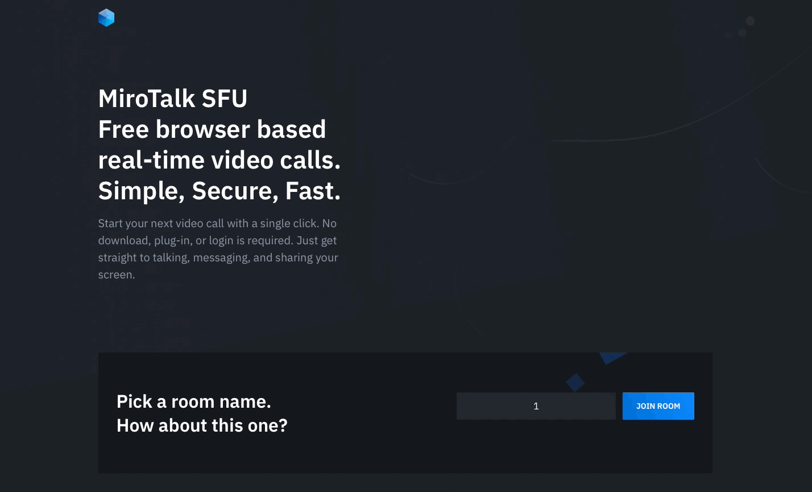

<h1 align="center">MiroTalk SFU</h1>

<h3 align="center">Open Source Zoom Alternative You Can Self-Host in Minutes</h3>

<h4 align="center">Free, Secure, Scalable Video Conferences powered by WebRTC & Mediasoup SFU - up to 8K, 60fps.</h4>

<br />

<div align="center">

[](https://github.com/miroslavpejic85/mirotalksfu/stargazers)
[](https://github.com/miroslavpejic85/mirotalksfu/network/members)

<a href="https://choosealicense.com/licenses/agpl-3.0/"></a>
<a href="https://hub.docker.com/r/mirotalk/sfu"></a>
<a href="https://github.com/miroslavpejic85/mirotalksfu/commits/main"></a>
<a href="https://discord.gg/rgGYfeYW3N"></a>
<a href="https://www.linkedin.com/in/miroslav-pejic-976a07101/"></a>

</div>

<br />

<p align="center"><strong>MiroTalk SFU</strong> is a <strong>self-hosted, open-source video conferencing</strong> platform built on <a href="https://mediasoup.org" target="_blank">Mediasoup</a> (Selective Forwarding Unit). It's a powerful <strong>Zoom, Google Meet, and Microsoft Teams alternative</strong> you can deploy on your own server in minutes. Enjoy unlimited rooms, no time limits, end-to-end privacy, and a rich feature set - all under your control.</p>

<p align="center">
    <a href="https://sfu.mirotalk.com/"></a>
    &nbsp;
    <a href="https://docs.mirotalk.com/mirotalk-sfu/self-hosting/"></a>
    &nbsp;
    <a href="https://discord.gg/rgGYfeYW3N"></a>
    &nbsp;
    <a href="https://github.com/sponsors/miroslavpejic85"></a>
</p>

<br />

<p align="center">
    <a href="https://sfu.mirotalk.com/">
        
    </a>
</p>

<p align="center">Proudly sponsored by</p>

<h1 align=center>Recall.ai - API for meeting recording</h1>
<p align="center">
    <a href="https://www.recall.ai/?utm_source=github&utm_medium=sponsorship&utm_campaign=miroslavpejic85-mirotalksfu"><strong>Recall.ai</strong></a> – an API for recording Zoom, Google Meet, Microsoft Teams, and in-person meetings.
</p>

<hr />

<br/>

<details open>
<summary>✨ Why MiroTalk SFU?</summary>

<br/>

|                      | MiroTalk SFU                                                                                                                                        | Zoom / Meet / Teams         |
| -------------------- | --------------------------------------------------------------------------------------------------------------------------------------------------- | --------------------------- |
| 💰 **Cost**          | Free & Open Source (AGPLv3). [One-time fee licenses](https://codecanyon.net/item/mirotalk-sfu-webrtc-realtime-video-conferences/40769970) available | Paid plans                  |
| 🏠 **Self-hosted**   | ✅ Full control over your data                                                                                                                      | ❌ Cloud only               |
| 🔒 **Privacy**       | Your server, your rules                                                                                                                             | Third-party data processing |
| ⏱️ **Time limits**   | Unlimited                                                                                                                                           | 40-60 min on free tiers     |
| 🏢 **Rooms**         | Unlimited concurrent rooms                                                                                                                          | Limited                     |
| 🎥 **Resolution**    | Up to 8K @ 60fps                                                                                                                                    | Up to 1080p                 |
| 🌍 **Languages**     | 133 languages                                                                                                                                       | ~30-80                      |
| 🔌 **API**           | Full REST API included                                                                                                                              | Paid add-on                 |
| 📡 **RTMP/OBS**      | Built-in RTMP streaming                                                                                                                             | Third-party needed          |
| 🤖 **AI Features**   | ChatGPT, DeepSeek + VideoAI integration                                                                                                             | Paid AI add-ons             |
| 🧩 **Customization** | Full source code, white-label ready                                                                                                                 | Limited branding options    |
| 📦 **Deployment**    | Docker, Node.js, one-click install                                                                                                                  | N/A (SaaS only)             |

</details>

<details open>
<summary>🚀 Features</summary>

<br/>

- 🎥 Video up to **8K @ 60fps** · Screen sharing · Recording · Picture-in-Picture
- 💬 Chat with Markdown & emoji · Collaborative whiteboard and Rich text editor · File sharing
- 🤖 ChatGPT (OpenAI) & DeepSeek integration · VideoAI avatars · Speech recognition
- 🔒 OIDC auth · [Host protection](https://docs.mirotalk.com/mirotalk-sfu/host-protection/) · JWT credentials · Room passwords · Lobby & spam mitigation
- 🔌 REST API · Slack, Discord & Mattermost · Embeddable [iframe](https://docs.mirotalk.com/mirotalk-sfu/integration/#iframe) & [widget](https://docs.mirotalk.com/mirotalk-sfu/integration/#widgets-integration) · 133 languages

**[See all features →](https://docs.mirotalk.com/mirotalk-sfu/)**

</details>

<details open>
<summary>⚡ Quick Start</summary>

<br/>

**Start in 6 commands:**

```bash
git clone https://github.com/miroslavpejic85/mirotalksfu.git
cd mirotalksfu
cp app/src/config.template.js app/src/config.js
cp .env.template .env
npm install
npm start
```

Open [https://localhost:3010](https://localhost:3010) - done!

---

<details>
<summary>📋 Full Setup Guide (Requirements & Details)</summary>

<br/>

Before running MiroTalk SFU, ensure you have `Node.js` and all [requirements](https://mediasoup.org/documentation/v3/mediasoup/installation/#requirements) installed. This project has been tested with Node version [22.X](https://nodejs.org/en/download).

Requirements install example for `Ubuntu 24.04 LTS`:

```bash
apt-get update
apt-get install -y build-essential
DEBIAN_FRONTEND=noninteractive apt-get install -y tzdata
apt install -y software-properties-common
add-apt-repository -y ppa:deadsnakes/ppa
apt update
apt install -y python3.8 python3-pip
apt install -y ffmpeg
```

---


Install `NodeJS 22.X` and `npm` using [Node Version Manager](https://docs.mirotalk.com/nvm/nvm/)

---

Start the server:

```bash
git clone https://github.com/miroslavpejic85/mirotalksfu.git
cd mirotalksfu
cp app/src/config.template.js app/src/config.js
cp .env.template .env
npm install
npm start                          # or: SERVER_LISTEN_PORT=3011 npm start
```

Open [https://localhost:3010](https://localhost:3010) - done!

> \[!NOTE]
>
> To run `MiroTalk SFU` on a `Windows operating system`, you can follow the instructions provided in [this documentation](https://github.com/miroslavpejic85/mirotalksfu/issues/99#issuecomment-1586073853).

</details>

</details>

<details open>
<summary>🐳 Docker</summary>

<br/>


**Prerequisites:** Install [Docker Engine](https://docs.docker.com/engine/install/) and [Docker Compose](https://docs.docker.com/compose/install/) - Image available on [Docker Hub](https://hub.docker.com/r/mirotalk/sfu)

```bash
git clone https://github.com/miroslavpejic85/mirotalksfu.git
cd mirotalksfu
cp app/src/config.template.js app/src/config.js
cp .env.template .env
cp docker-compose.template.yml docker-compose.yml
docker-compose pull    # optional: pull official image
docker-compose up      # add -d to run in background
```

Open [https://localhost:3010](https://localhost:3010) - done!

> **Note:** Edit `app/src/config.js`, `.env`, and `docker-compose.yml` to customize your setup.

</details>

<details>
<summary>📚 Documentation</summary>

<br/>

For detailed guides and references, visit the **[official documentation](https://docs.mirotalk.com)**:

- [About](https://docs.mirotalk.com/mirotalk-sfu/)
- [Self-Hosting Guide](https://docs.mirotalk.com/mirotalk-sfu/self-hosting/)
- [Automation-scripts](https://docs.mirotalk.com/scripts/about/)
- [Configurations](https://docs.mirotalk.com/mirotalk-sfu/configurations/)
- [Rebranding](https://docs.mirotalk.com/mirotalk-sfu/rebranding/)
- [Host Protection Mode](https://docs.mirotalk.com/mirotalk-sfu/host-protection/)
- [Integration](https://docs.mirotalk.com/mirotalk-sfu/integration/)
- [Direct Room Join](https://docs.mirotalk.com/mirotalk-sfu/join-room/)
- [RTMP Setup](https://docs.mirotalk.com/mirotalk-sfu/rtmp/)
- [REST API Documentation](https://docs.mirotalk.com/mirotalk-sfu/api/)
- [Scalability](https://docs.mirotalk.com/mirotalk-sfu/scalability/)
- [Ngrok](https://docs.mirotalk.com/mirotalk-sfu/ngrok/)
- [Updates](https://docs.mirotalk.com/mirotalk-sfu/updates/)
- [WebHook](https://docs.mirotalk.com/mirotalk-sfu/webhook/)

</details>

<details open>
<summary>☁️ Recommended Hosting Providers</summary>

<br/>

| Provider                                                                                           | Description                                                                                                                                                          | Link                                                                |
| -------------------------------------------------------------------------------------------------- | -------------------------------------------------------------------------------------------------------------------------------------------------------------------- | ------------------------------------------------------------------- |
| [](https://www.cloudron.io/)                          | One-click install from the [Cloudron App Store](https://www.cloudron.io/store/index.html). Automates deployment, updates, backups, and user management.              | [Get Started](https://www.cloudron.io/)                             |
| [](https://www.hetzner.com)                                 | One of the best [cloud providers](https://www.hetzner.com/cloud) and [dedicated root servers](https://www.hetzner.com/dedicated-rootserver). Used for our live demo. | [Get €20 Free Credits](https://hetzner.cloud/?ref=XdRifCzCK3bn)     |
| [](https://www.netcup.com/en/?ref=309627)                     | Enterprise-grade performance at unbeatable prices. Scalable and reliable.                                                                                            | [Explore Netcup](https://www.netcup.com/en/?ref=309627)             |
| [](https://hostinger.com/?REFERRALCODE=MIROTALK) | Fast, reliable hosting with 24/7 support and great performance.                                                                                                      | [Check out Hostinger](https://hostinger.com/?REFERRALCODE=MIROTALK) |
| [](https://www.dpbolvw.net/click-101027391-14462707) | Top-tier German hosting, dedicated servers, VPS, and web hosting at unbeatable prices.                                                                               | [Explore Contabo](https://www.dpbolvw.net/click-101027391-14462707) |

To set up your own instance of `MiroTalk SFU` on a dedicated cloud server, please refer to our comprehensive [self-hosting documentation](https://docs.mirotalk.com/mirotalk-sfu/self-hosting/).

</details>

<details>
<summary>🙏 Credits</summary>

<br/>

- [Davide Pacilio](https://cruip.com/demos/solid/) (html template)
- [Dirk Vanbeveren](https://github.com/Dirvann) (sfu logic)
- [Mediasoup](https://mediasoup.org) (sfu server)

</details>

<details>
<summary>🤝 Contributing</summary>

<br/>

Contributions are welcome and greatly appreciated! Whether it's bug fixes, features, or documentation - every contribution helps.

1. Fork the repository
2. Create your feature branch
3. Run `npm run lint` before committing
4. Submit a pull request

Have questions? Join our [Discord community](https://discord.gg/rgGYfeYW3N)!

</details>

<details>
<summary>📄 License</summary>

<br/>

[](LICENSE)

MiroTalk SFU is free and open-source under the terms of AGPLv3 (GNU Affero General Public License v3.0). Please `respect the license conditions`, In particular `modifications need to be free as well and made available to the public`. Get a quick overview of the license at [Choose an open source license](https://choosealicense.com/licenses/agpl-3.0/).

To obtain a [MiroTalk SFU license](https://docs.mirotalk.com/license/licensing-options/) with terms different from the AGPLv3, you can conveniently make your [purchase on CodeCanyon](https://codecanyon.net/item/mirotalk-sfu-webrtc-realtime-video-conferences/40769970). This allows you to tailor the licensing conditions to better suit your specific requirements.

</details>

<details open>
<summary>Support the project</summary>

<br/>

Do you find MiroTalk SFU indispensable for your needs? Join us in supporting this transformative project by [becoming a backer or sponsor](https://github.com/sponsors/miroslavpejic85). By doing so, not only will your logo prominently feature here, but you'll also drive the growth and sustainability of MiroTalk SFU. Your support is vital in ensuring that this valuable platform continues to thrive and remain accessible for all. Make an impact - back MiroTalk SFU today and be part of this exciting journey!

|                                                                                                                    |                                                                                   |                                                                                |
| ------------------------------------------------------------------------------------------------------------------ | --------------------------------------------------------------------------------- | ------------------------------------------------------------------------------ |
| [](https://cloudron.io)                                                   | [](https://effectssdk.ai/)           | [](https://www.questionpro.com) |
| [](https://www.testmuai.com/?utm_medium=sponsor&utm_source=mirotalk) | [](https://www.browserstack.com) | [](https://crystalsound.ai)   |
| [](https://www.netcup.com/en/?ref=309627)                                     |                                                                                   |                                                                                |

</details>

<details open>
<summary>Past Sponsors</summary>

<br/>

We are grateful to our past sponsors for their support!

|                                                                                        |                                                                 |                                                                         |
| -------------------------------------------------------------------------------------- | --------------------------------------------------------------- | ----------------------------------------------------------------------- |
| [](https://hetzner.cloud/?ref=XdRifCzCK3bn) | [](https://kiquix.com) | [](https://broadcastx.de/) |
| [](https://luvlounge.ca)                    |                                                                 |                                                                         |

</details>

<details open>
<summary>Advertisers</summary>

---

|                                                                                                |                                                                                                |                                                                                 |
| ---------------------------------------------------------------------------------------------- | ---------------------------------------------------------------------------------------------- | ------------------------------------------------------------------------------- |
| [](https://hostinger.com/?REFERRALCODE=MIROTALK) | [](https://www.dpbolvw.net/click-101027391-14462707) | [](https://rambox.app?via=mirotalk) |

---

</details>

## ✨ EffectsSDK

[](https://effectssdk.ai/)

`Enhance your video conferencing` experience with `advanced virtual backgrounds` and `noise suppression`. EffectsSDK offers powerful SDKs and plugins for fast integration.

**Explore:**

- 🎥 **[AI Video Effects Extension](https://chromewebstore.google.com/detail/effetti-webcam-ai-+-regis/iedbphhbpflhgpihkcceocomcdnemcbj)**: Add virtual backgrounds and effects to your webcam.
- 🔊 **[Noise Cancelling Extension](https://chromewebstore.google.com/detail/noise-cancelling-app/njmhcidcdbaannpafjdljminaigdgolj)**: Reduce background noise for clearer audio.
- 🛠️ **[Integrate EffectsSDK](https://github.com/EffectsSDK)**: Access SDKs and plugins for custom solutions.

---

🌐 **Explore all MiroTalk projects:** [MiroTalk Overview →](https://docs.mirotalk.com/overview/)

---

This project is tested with [BrowserStack](https://www.browserstack.com).

---

## Star History

If you like this project, please star it - every star helps more people discover this free Zoom alternative!

[](https://star-history.com/#miroslavpejic85/mirotalksfu&Date)

---

<p align="center">
  Built with ❤️ by <a href="https://www.linkedin.com/in/miroslav-pejic-976a07101/">Miroslav</a> and the open-source community
</p>
