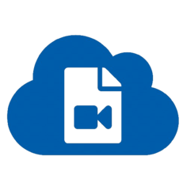

# Cloud Recording



To save `recordings` on a different `server` or `cloud service` copy this `cloud folder` to the desired server.

## Quick Start

```bash
# Install dependencies
npm install

# Start the server
npm start
```

## Edit config.js

In the MiroTalk SFU `app/src/config.js` file, change the endpoint to send recording chunks:

```js
recording: {
	endpoint: 'http://localhost:8080', // Change it with your Server endpoint
	dir: 'rec',
	enabled: true,
},
```
