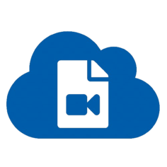

# Cloud Recording



To save `recordings` on a different `server` or `cloud service` copy this `cloud folder` to the desired server.

## Quick Start

```bash
# Install dependencies
npm install

# Start the server
npm start
```

## Edit config.js

In the MiroTalk SFU `.env` file, change the endpoint to send recording chunks:

```bash
RECORDING_ENDPOINT=http://localhost:8080
```

## Security

Uploads to `/recSync` are authenticated with a short-lived, room-bound token issued by the
main MiroTalk SFU server when a user joins a room. The client automatically forwards this
token, and this server verifies it before accepting any data.

For verification to succeed, this server **must** be configured with the **same JWT secret**
as the main MiroTalk SFU server:

```bash
# Must match JWT_SECRET on the main MiroTalk SFU server
JWT_SECRET=your-strong-shared-secret

# Optional per-IP rate limit for uploads (defaults shown)
RECORDING_RATE_LIMIT_WINDOW_MS=60000   # window in ms (default: 60s)
RECORDING_RATE_LIMIT_MAX=300           # max upload requests per IP per window
```

> If `JWT_SECRET` is not set, both servers fall back to the same default secret. Always set a
> strong, matching secret on both in production.
